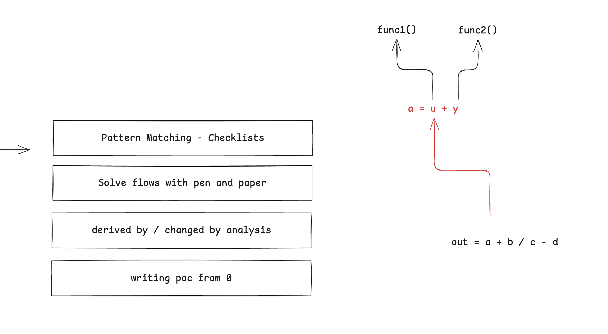

# Meeting notes for 9th of July, 2025

### Discussions
- green bee - Coinbase bug bounty
- vesko210 - The importance of fully understanding the code when submitting a bug
	- Escalations and discussions with the judges
- green bee - Accountants
- velev - What to do once we know the project?
- givn - Methods of analysis
	- 
	- Pattern matching - find previously known issues, build your own checklist
	- Write down flows with pen and paper - great for understanding the codebase and verifying if logic is correct
	- [d/c analysis](https://x.com/0xGivn/status/1915773413928435794) - can be helpful to find intersecting flows. Useful when you already know the codebase
	- Write a PoC from scratch - this will help you uncover all the interconnected dependencies of the system, faster to play out scenarios than pen & paper. Useful to find issues when you already verified the correctness of everything.
- mmoyse - how I started looking for [bugs](https://github.com/x676f64/secureum-mind_map?tab=readme-ov-file)
- mmoyse & 0xfirefist - Secureum races
- 0xfirefist - Advice from gogo: If you have no ideas clone the codebase again and look at it without comments
	- you can also switch branches
- velev - How often do you go back to previous audit submissions
- vesko210 - you can sort findings by reputation score to read findings before being sorted
- dsbex - team audits - how do you approach them?

### Resources
- a good [git client](https://git-fork.com/) if you don't like the CLI
