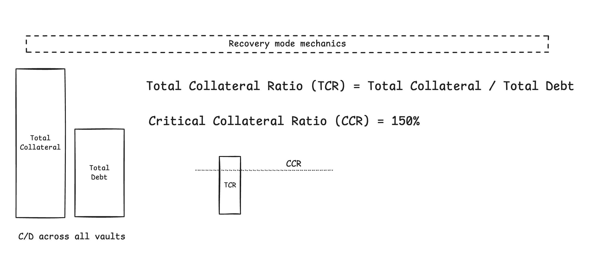

# Meeting notes for 18th of June, 2025

Article discussions
- [0xGivn](https://x.com/0xGivn) - [The Bug That Was Missed](https://getrecon.substack.com/p/the-bug-that-was-missed) breakdown
  - why is it important to look for rounding issues causing inflation
  - excellent example for elevating low to critical by abusing protocol mechanics
  - 
- [0xGivn](https://x.com/0xGivn) - [Alex The Enterprenerd explains how Recon does fuzz testing](https://www.youtube.com/watch?v=-d2rLOQB3l0&ab_channel=rxyz)
- [@zdravkohristov0](https://x.com/zdravkohristov0) - [invariant testing & fuzzing @ Guardian](https://guardianaudits.notion.site/Why-Audited-Projects-Are-Getting-Hacked-How-To-Avoid-It-Invariants-1d78bda5828c804fb1c1c2263ab5766a)

Bugs discussion
- [@Merulez99](https://x.com/Merulez99) - superform hooks, smart wallets with account abstraction, malicious front-running of superform bridging tx
- [0xGivn](https://x.com/0xGivn) - [url spoofing](https://icecream23.medium.com/i-fooled-the-filters-homoglyph-username-bypass-vulnerability-an-overlooked-threat-in-major-dd5f8cc63ba6) is considered a bug on some web2 platforms 
  - but on Upside it was deemed [invalid](https://code4rena.com/audits/2025-05-upside/submissions/S-265)

Other
- [@zdravkohristov0](https://x.com/zdravkohristov0) - verifying how [swap opcode](https://www.evm.codes/) works
