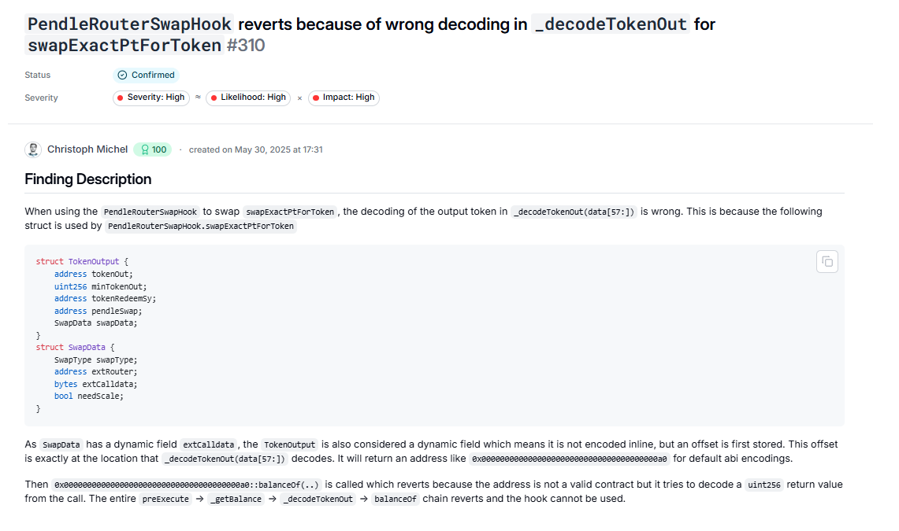

# Meeting notes for 30th of July, 2025

### Discussions

- givn - auditing yul with evm playground & hex editor
	- you can use https://www.evm.codes/playground (select Yul language) to run specific slices of code
	- good online [hex editor](https://hexed.it/)
		- Settings -> Number of bytes per row -> 32 bytes
		- When pasting, make sure to select `Hexadecimal Values` from the dropdown

- merulez - calldata encoding and malicious call injection
	- [ABI Encoding and EVM Calldata demystified](https://r4bbit.substack.com/p/abi-encoding-and-evm-calldata) 
		- how are dynamic types encoded in call data
		- how to assemble specific calldata payload with cast
	- solo finding from cmichel
		- 
	- [Reversing The EVM: Raw Calldata](https://degatchi.com/articles/reading-raw-evm-calldata)
	- [ABI Encoding | EVM Memory 8](https://www.youtube.com/watch?v=V2UmrTydJXU)

- cyborg - EIP7702 
	- security risks like initializer frontrunning & mitigations
	- [What is EIP-7702?](https://medium.com/coinmonks/what-is-eip-7702-5c3fd347107d)
	- Classic contracts that can't rely on contract detection - [VotingEscrow.vy](https://github.com/curvefi/curve-dao-contracts/blob/fa127b1cb7bf83e4f3d605f7244b7b4ed5ebe053/contracts/VotingEscrow.vy#L184-L195)

- merulez - TWAP pricing manipulation viability
