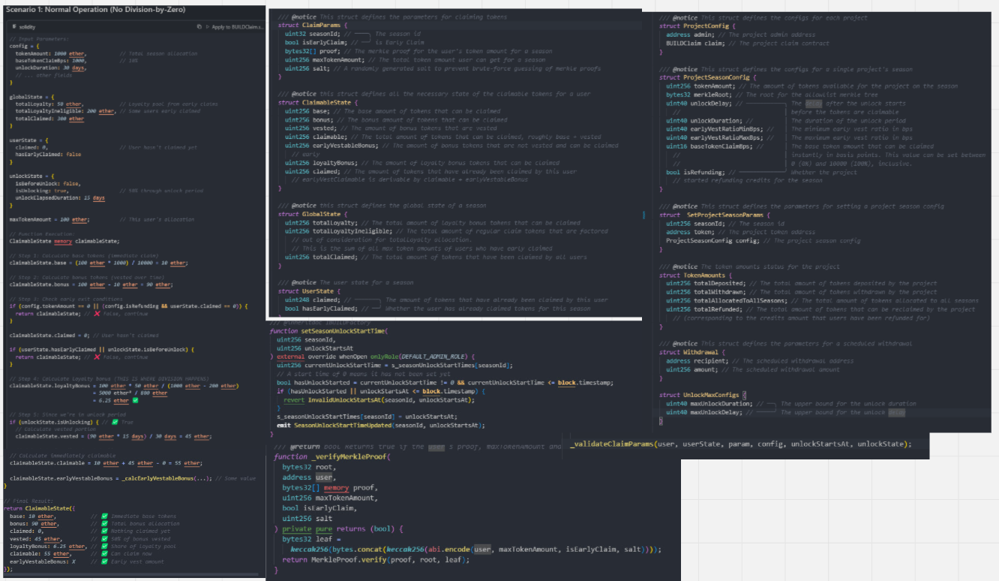

# Meeting notes for 18th of June, 2025

### Bug discussions
- [0xGivn](https://x.com/0xGivn) - Aquarius AMM [findings](https://cantina.xyz/competitions/990ce947-05da-443e-b397-be38a65f0bff) - what can we expect to find in an AMM audit?
- [Merulez99](https://x.com/Merulez99) - [Ignite Market](https://hackenproof.com/audit-programs/ignite-market-audit-contest) & front-run possibilities on non-public mempools

### What good looks like
- [0xGivn](https://x.com/0xGivn) - [Chainlink Rewards](https://code4rena.com/audits/2025-06-chainlink-rewards) - a great example of a well done project & contest

### Ways of working
- [0xGivn](https://x.com/0xGivn) - adding `@notice` tag field names for a struct for better visibility in the IDE. Very helpful in the beginning of an audit. Hovering over the struct can display all field names:
```js
/// @notice admin, maxUnlockDuration & Delay, delegateRegistry
struct ConstructorParams {
	address admin;
	uint40 maxUnlockDuration;
	uint40 maxUnlockDelay; 
	IDelegateRegistry delegateRegistry;
}
```

- [Merulez99](https://x.com/Merulez99) - assembling a digital drawing board with the most often referenced pieces of the code
  - 

- [chrissavov](https://x.com/chrissavov) - [VigilSeek](https://www.vigilseek.com/) - accurate representation of all running tests, updates often

### Tweets

- [Merulez99](https://x.com/Merulez99) - [When to stop auditing](https://x.com/0xCharlesWang/status/1937565933096305129) by Charles Wang
- [0xGivn](https://x.com/0xGivn) - [how many times you need to analyze a function before you can uncover deep bugs](https://x.com/Guhu95/status/1937111023431172146) by Guhu 
  - great example that can serve as a personal standard
